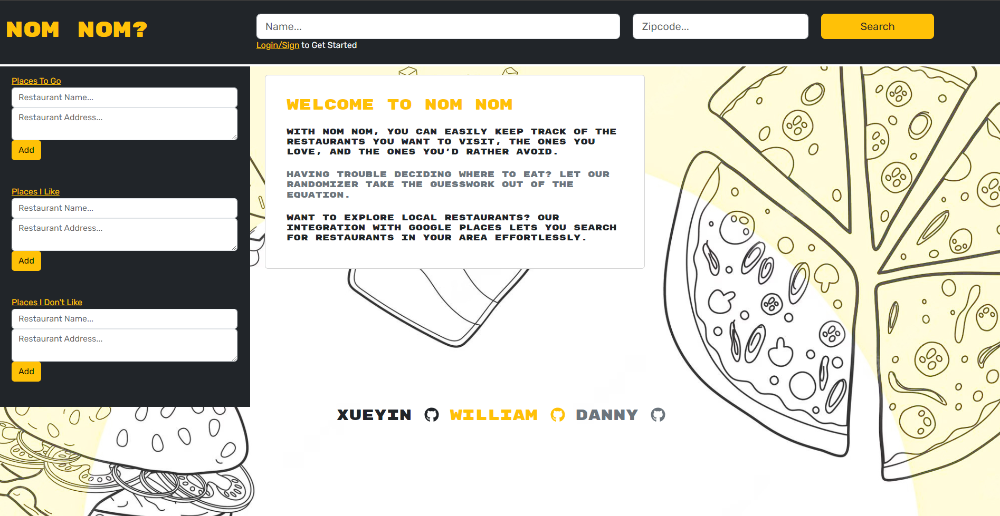

# Nom nom?

## Table of Contents
- [Description](#description)
- [Packages](#packages)
- [Usage](#usage)
- [Screenshots](#Screenshots)
- [Credits](#Credits)
- [Contributors](#Contributors)
- [License](#license)

## Description

Discovering your next favorite restaurant has never been easier. With Nom Nom, you can easily keep track of the restaurants you want to visit, the ones you love, and the ones you'd rather avoid. Our app offers a range of features to simplify your dining decisions and ensure you never miss out on a great meal.

Keep track of your restaurant preferences effortlessly. Simply enter the names of the restaurants you'd like to visit, those you've enjoyed, and even those you'd rather skip. Nom Nom allows you to create personalized lists, making it convenient to organize and update your choices.
Having trouble deciding where to eat? Let our randomizer take the guesswork out of the equation. If you can't make up your mind, simply select the randomizer feature for restaurants you love. Nom Nom will suggest a fantastic dining option from your list, guaranteeing a delightful culinary experience.
Want to explore local restaurants? Our integration with Google Places lets you search for restaurants in your area effortlessly. Whether you're craving a specific cuisine or looking for a hidden gem, Nom Nom will provide you with accurate and up-to-date information about nearby dining options.
No more struggling to decide where to eat or forgetting the name of that amazing restaurant you heard about. Nom Nom has you covered, ensuring every dining experience is exceptional.
Download Nom Nom today and let the culinary adventures begin!
## Packages

- Node.js
- Express.js
- Apollo
- GraphQl
- React
- React-bootstrap
- React-router
- MongoDb
- Mongoose
- Bcrypt
- JSON Web Token
- prettier
- Eslint

## Usage
The application can be used in a browswer directly from Heroku or locally on their computer.
- [Heroku](#browser)
- [Locally](#locally)

## Browser

You can use the application in your browser through Heroku here: [Nom Nom?](https://nom-nom-2023-d9595dea6646.herokuapp.com/)

## Locally

Clone the repo

```
git clone https://github.com/danieltran2016/Nom_Nom
```

Install all the required packages in the package.json:

```
npm i
```

Start the application:

```
npm start
```

Open your web browser and use the URL:
```
 `http://localhost:3001/`.
```

## Screenshots



## Credits
We would like to credit our instructor, Jeremy. Our two TA's, Will and Madison. Their help and guidance was momentous in developing the skills we needed to make a full stack web application. Thier help along with notes and examples provided a strong framework for the project. 


## Contributors
- [Xueyin Bai](https://github.com/xybai0103)
- [William Combee](https://github.com/Willyum863)
- [Daniel Tran](https://github.com/danieltran2016)

## License

[MIT License](https://opensource.org/licenses/MIT).